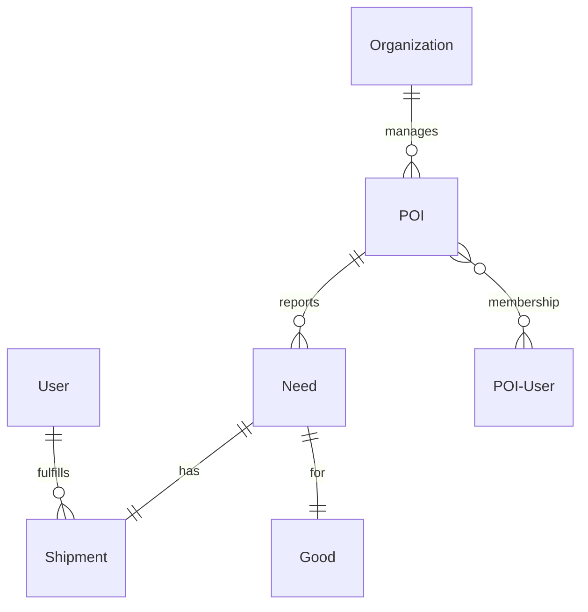

# SFN: Support for Needs

It is a platform based on web application with pc, tablets, phone as a client
that is helping to organize and coordinate managing needs between points of interests [poi] (single places, warehouses, volunteers). 
Its main goal is to shorten time to share needs and to better control needs validation.
Sharing info by one click on main page or facebook (or any other media) additionally relieves the load of a volunteer or any person working in the process. 
Also information is better standarized so other parties have simpler task to answer specific need.

## Vocabulary

**product**: any resource like water, sandwich, paper, doctor, injection, psyche help, etc

**good**: product kind or help type: sandwith, water, trolley, medic

**need**: need of a specific good: *I need water here (send me some water please) -> send me 10 botles of water*

**status of a need**: need (now), not needed anymore (just arrived or smth), in delivery (someone clicked that it is in delivery)

**POI user**: human who is working in poi/org doing something, can be contacted etc

**POI**: point of interest: a place with some product ready to be taken by someone, has some needs, has a POI user managing, can be in organization

**org**: object collecting other object (POIs, POI users, other org) - it is mainly for grouping needs in one object on every level

**user**: a human that can help by managing POI or by fulfilling POIs need

**shipment**: goods on theirs way to satisfy POIs needs

# Dashboards
POI level
- can see any need in any poi (filtered by averything)
- can add products (on stock, not on stock but needed)
- can add need for a product
- can change status of a product
- can change status of need (delivered, not needed for now, can share due to overlimit)
- can send request for a produkt to others (pois)
- can send info about having some for a needed product (should by default (?))

Global level (not logged/registered, no role etc):
- can see any need in any poi (filtered by averything), limited to soem time interval

Registered user level: (?)
- can see any need in any poi (filtered by averything)
- can answer for a need: i will deliver 3 bottles of water in 10 minutes
- can cancel answer for a need (sorry, it happened i don't have it)

---
Features:
- login by google
- login by facebook
- anyone can login
- poi needs to be approved by admin (?) or organisation admin if there will be bigger structure
- ? product needs to be approved by admin (for protection, sex offers and anyother bad things) - automate
- orgnization to be approved by uber admin
- one user can be connected with many poi
- one user can be connected with many org
- one poi can have many users
- one poi can be in many org
- user/poi/org can share all needs on facebook
- user/poi can share its needs on facebook
- need can can be sent on facebook (just one position on facebook if poi or org)
- should have support for may languages (polish, ukr, english, others)
- have to be client platform aware (pc, tablets, phones) and change layout accordingly

# Domain model

## Organization

Entity having poi and other organizations in his hands
- id
- name
- description
- contact
- facebook id

## User

Human with a name and contact, working with SFN initiative
- first name
- last name
- email
- description
- contact
- date created
- date updated

## POI

Place with some resource or service (for example, a place with boxem full od water near train station, it hase needs, it hase some current status)
- id
- name 
- description
- location (geocord)
- contact info
- orgnization.id
- facebook.id (if other than org.facebook.id)
- dates, and updates time, users
- status (working, online, off etc)

## Good

Just some product or services that can be needed by someone or somewhere
- name
- description
- link
- date created
- date updated
- created by

## Need

- Good name
- quantity needed (litres, kg, pcs etc)
- how much time need is valid (eg, i need this by tomorrow, because in a 5 days everyone will be dead already etc, or, i will need it on friday, not now)
- created by
- created when
- create where
- poi.id
- status: active, disabled

# Infrastructure

Infra is on me, I can use AWS infra if needed for the start, depends on needs (nomen omen:), I will pay for it or find other help.
We can use any aws resource if needed.
For now, I am doing it as volunteer in my free time, with my own money.
Infra details
- SSL usage is obvious (https://, db connections)
- secure env with AWS is also obvious

## Personal data

- org: rather public
- single person: private until set by him/her to be public (like phone number), maybe limited to view only by its org
- poi: rather public, maybe limited to view by org

# Risks
- even though concept is based on my personal observations, some practice and my friends, it can happen to be useless if users will not be using it for plenty of reasons. We need to take into consideration that most of users are just random voluunters wanting to help and it can be too much for them. Thats why is should sa simple as possible but brings some comfort and order.
- criminal user cases
- spamming with requests
- fake needs requests
- fake users, orgs

# Developers guide

## pre-commit setup

Install pre-commit with `pip install -U pre-commit` inside the virtualenv and then run `pre-commit install`.

## Environment variables

Application **requires** some environment variables:

- `SOCIAL_AUTH_GOOGLE_OAUTH2_KEY` (see Google Auth Configuration below)
- `SOCIAL_AUTH_GOOGLE_OAUTH2_SECRET` (see Google Auth Configuration below)
- `SOCIAL_AUTH_FACEBOOK_KEY` (App ID)
- `SOCIAL_AUTH_FACEBOOK_SECRET` (App Secret)

If you don't plan to use Google Auth or FB Auth locally, just set empty variables.

## Google Auth Configuration

For local purposes you need to create own app and credentials.
Go to https://console.cloud.google.com/apis/credentials add New project and then Create credentials.
Select OAuth client ID, application type is Web application.
As "Authorized redirect URIs" set `http://127.0.0.1:8000/oauth/complete/google-oauth2/`
On the right side of screen you will see Client ID and Client secret. These are values that need to be set
as `SOCIAL_AUTH_GOOGLE_OAUTH2_KEY` and `SOCIAL_AUTH_GOOGLE_OAUTH2_SECRET` env variables.

## Database

    $ cat ~/.pg_service.conf
    [sfn]
    host=localhost
    user=postgres
    dbname=sfn
    port=5432

    $ cat src/.pgpass
    localhost:5432:sfn:postgres:sfn
    $ chmod 0600 src/.pgpass

    $ docker run --name sfn-pg -e POSTGRES_PASSWORD=sfn -d -p 5432:5432 postgres
    $ docker exec -it sfn-pg bash
    $ psql -U postgres
    $ CREATE DATABASE sfn;

    $ cd src
    $ ./manage.py migrate core 0001
    $ ./manage.py migrate

For more details why the migration done in two steps see https://code.djangoproject.com/ticket/23422

## Translations

To prepare files for translators:

    $ ./manage.py makemessages -a

These files are stored in repository

To see translations in running app you need run:

    $ ./manage.py compilemessages -a
    processing file django.po in /home/user/sfn/src/locale/en/LC_MESSAGES
    processing file django.po in /home/user/sfn/src/locale/pl/LC_MESSAGES
    processing file django.po in /home/user/sfn/src/locale/ua/LC_MESSAGES

These files ARE NOT stored in repository, thus must be created on each env separately
